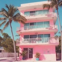
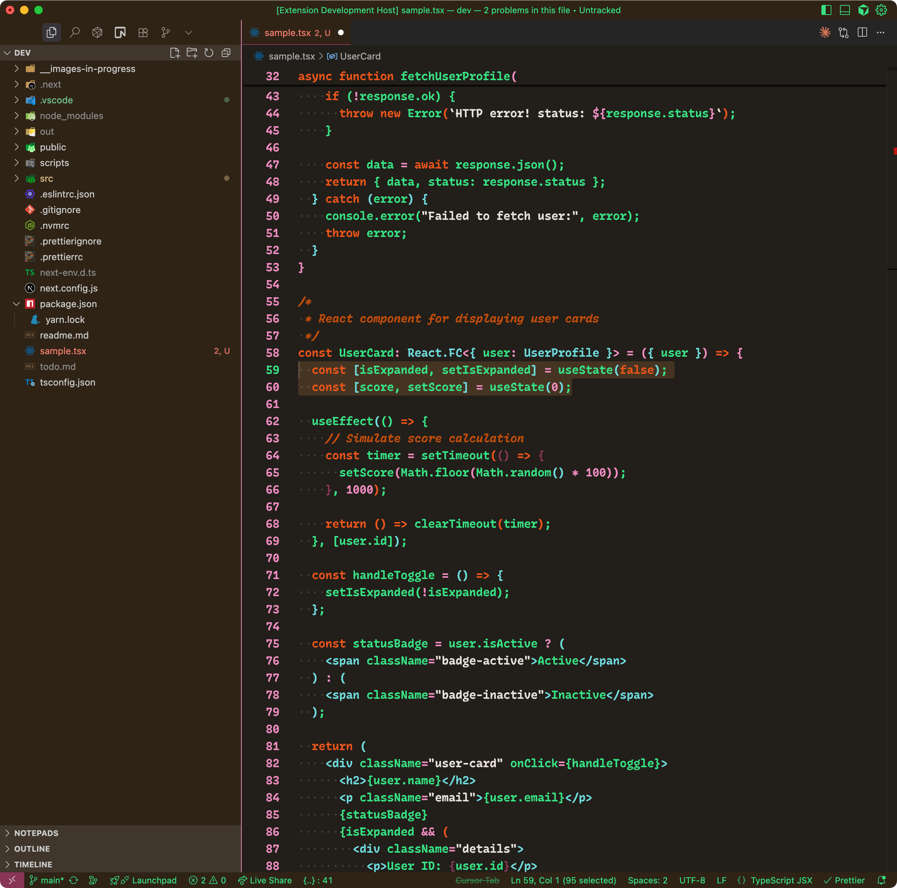
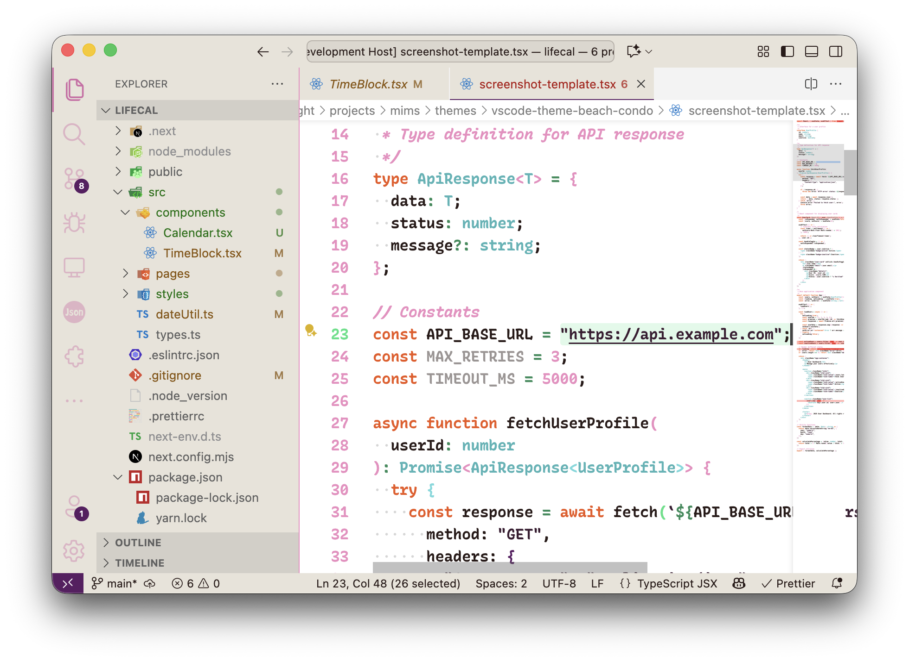
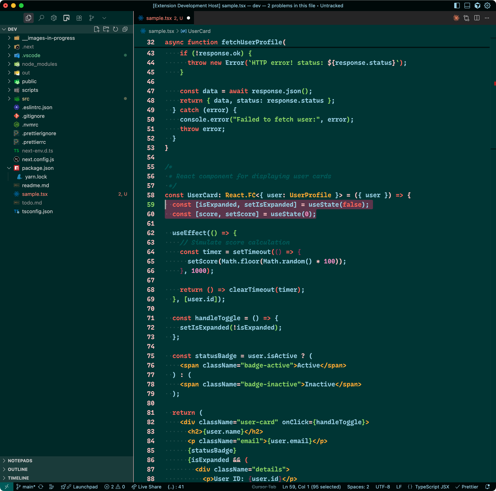
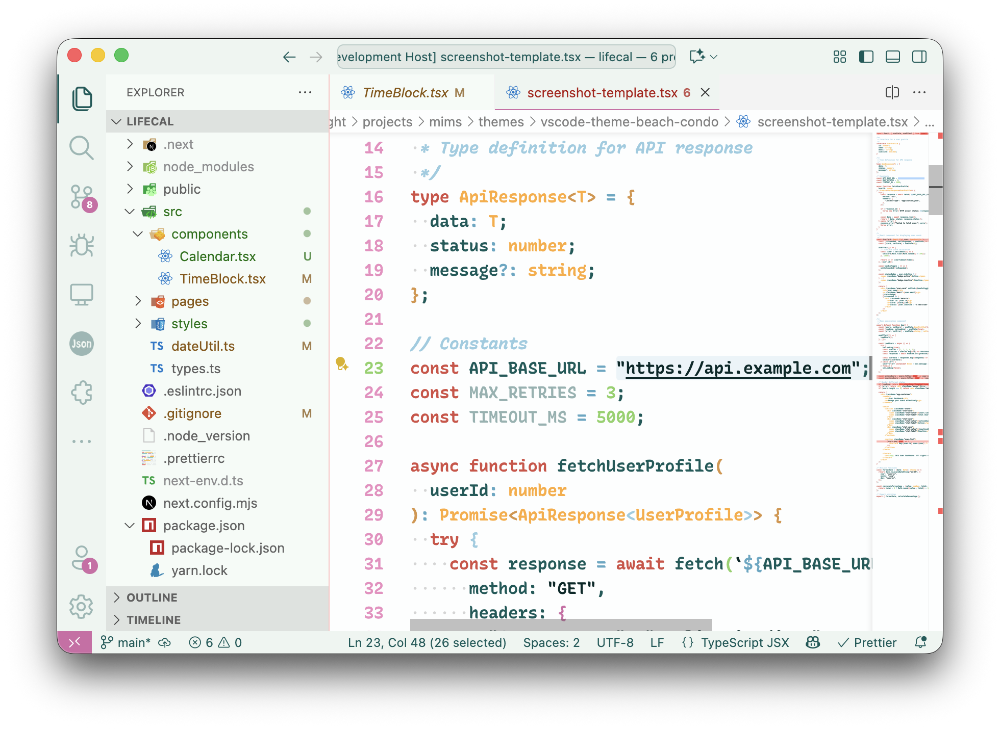
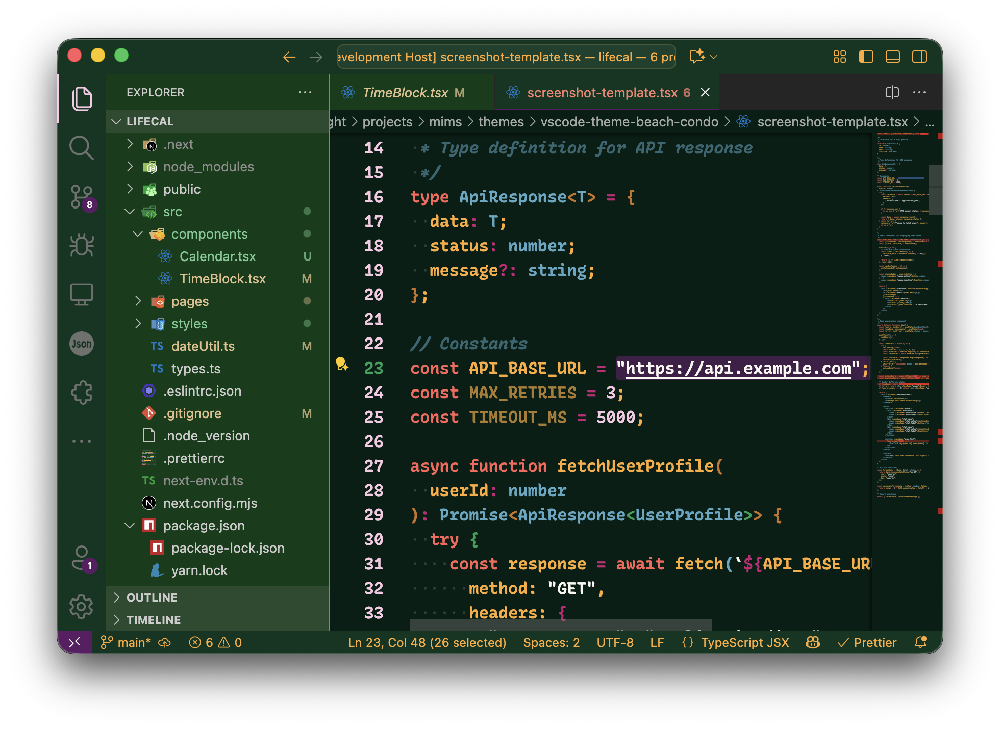
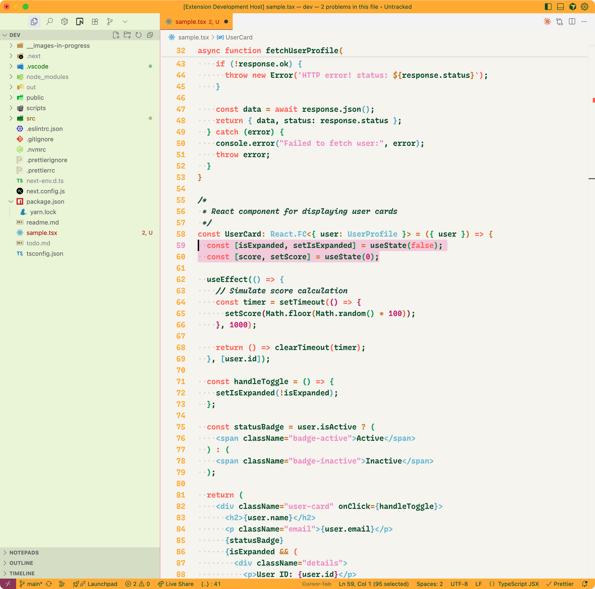
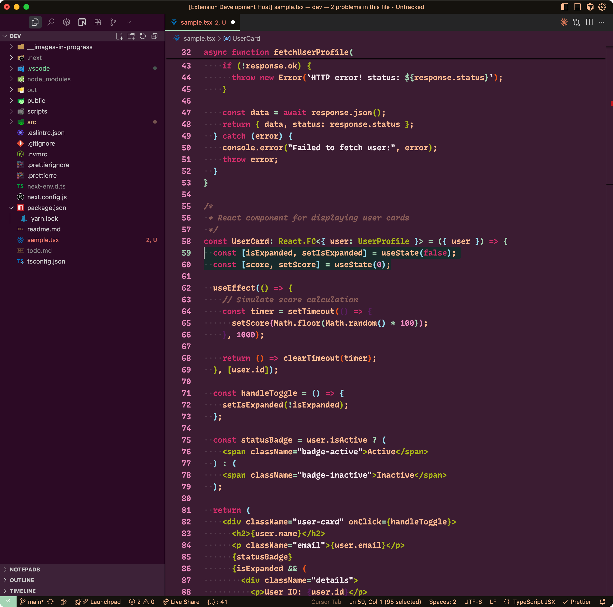
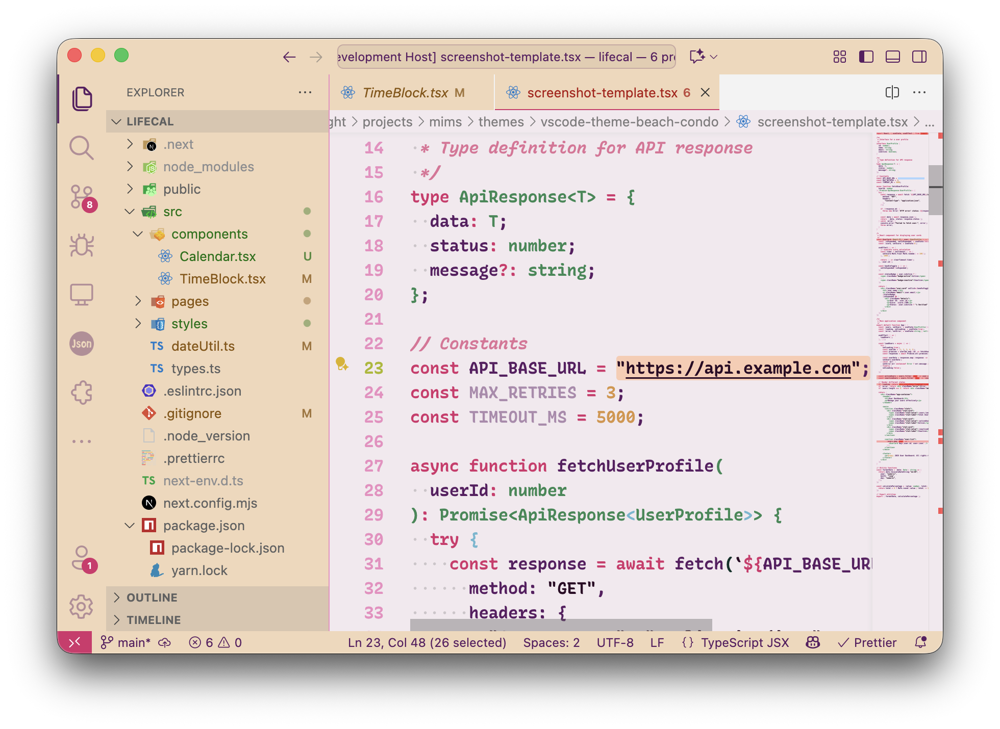

# Beach Condo



Themes for people who spend their whole vacation vibe coding.

## Themes

_Comes in 4 costal flavors..._

### Belize City

_Belize City isn't the capital, that's Belmopan. But Belmopan doesn't have beach._

<table>
<tr>
<td width="50%">

**Belize City - Dark**



</td>
<td width="50%">

**Belize City - Light**



</td>
</tr>
</table>

### Barcelona

_Stay in the condo because you don't want sand in your laptop; end up spilling vermouth on it anyway._

<table>
<tr>
<td width="50%">

**Barcelona - Dark**



</td>
<td width="50%">

**Barcelona - Light**



</td>
</tr>
</table>

### Bangkok

_Pad See Ew > Pad Thai. Don't @ me._

<table>
<tr>
<td width="50%">

**Bangkok - Dark**



</td>
<td width="50%">

**Bangkok - Light**



</td>
</tr>
</table>

### Brisbane

_I've never been to Australia becuase I watch nature documentaries so I know there are crazy scorpions everywhere. Nope. No way._

<table>
<tr>
<td width="50%">

**Brisbane - Dark**



</td>
<td width="50%">

**Brisbane - Light**



</td>
</tr>
</table>

## Development

To build the themes from source:

```bash
npm install
npm run build
```

To watch for changes:

```bash
npm run watch
```

## Contributing

Found an issue or have a suggestion? Please open an issue on the [GitHub repository](https://github.com/mimshwright/vscode-theme-beach-condo).

## License

MIT

## Credits

Created by Mims Wright
